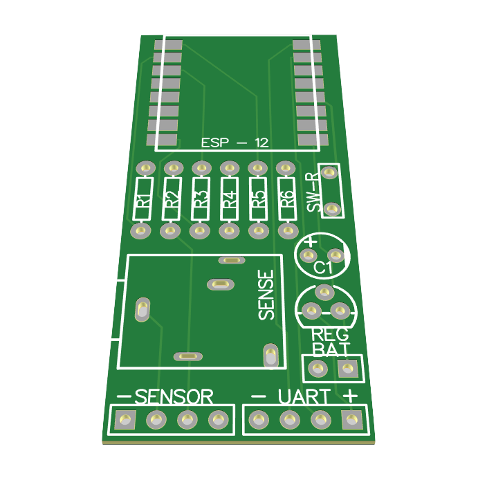

# Wireless Current Sensor ESP-12 SCT-013

View schematics and PCB design [on EasyEDA](https://easyeda.com/kasparsd/wireless-current-monitor).

## Design Notes

- Uses through-hole compnents for simplicity in the first prototype revision of the project.

- Design inspired and borrowed [from NodeMCU](docs/resources/nodemcu-schematics.png).

- The ADC on ESP8266 can handle only up to 1V input so we feed SCT013 current sensor input with regulated 3.3V and then bring down the output to maximum 1V via a resistor divider.
